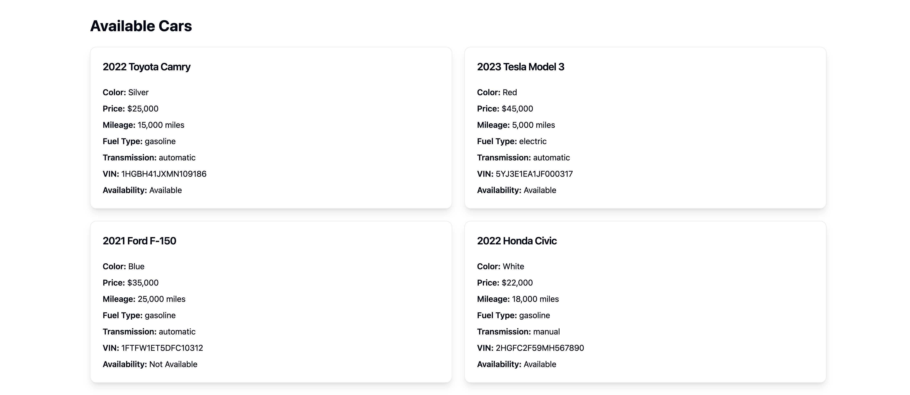

# MonoScript: Full-Stack TypeScript Project



MonoScript demonstrates a modern, full-stack TypeScript development environment, showcasing a monorepo-based application that integrates TypeScript, Express, and Vite in a contemporary web development stack. The image above provides a visual representation of the project's architecture and key components.

## Live Demo

Check out the live demo of MonoScript:

[MonoScript Live Demo](https://monorepo-typescript-vite-express.onrender.com/)

This link leads to a production deployment of the MonoScript project, showcasing the full functionality of the application in a real-world environment.

## Project Structure

This project is organized as a monorepo with the following main directories:

- `client/`: Frontend application crafted with Vite, React, and TypeScript.
  The user interface is styled using Shadcn components and TailwindCSS for a modern, responsive design.
- `server/`: Robust backend application powered by Express, handling API requests and business logic.
- `shared/`: Common TypeScript types, interfaces, and utility functions used across both client and server.

## Technologies Used

- **TypeScript**: Used throughout the project for type-safe development
- **Express**: Powers the backend API
- **Vite**: Builds and serves the frontend application
- **React**: Used for building the user interface
- **Node.js**: Runtime for the server
- **TailwindCSS**: Utility-first CSS framework for rapid UI development
- **Shadcn**: Component library built on top of TailwindCSS for consistent and customizable UI elements

### Installation and Running the Application

1. Clone the repository and navigate to the project directory:

   ```
   git clone https://github.com/john-smilga/monorepo-typescript-vite-express.git
   cd monoscript
   ```

2. Install dependencies for all packages:

   ```
   npm run install:all
   ```

3. Start the development servers (client, server, and shared):

   ```
   npm run dev
   ```

   This command will concurrently start the client dev server, the server, and run `tsx -w` in the shared package.

4. Open your browser and navigate to `http://localhost:5173` (or the port specified by Vite) to view the client application.

## Development

- The `client/` directory contains the React frontend application
- The `server/` directory contains the Express backend application
- Shared types and utilities can be found in the `shared/` directory

## Building for Production

1. Build the entire project:

   ```
   npm run deploy
   ```

   This command will build both the client and server applications.

2. Start the production server:

   ```
   npm start
   ```

   This will start the production server, serving the built client application.

## Contributing

Contributions are welcome! Please feel free to submit a Pull Request.

## License

This project is licensed under the [MIT License](LICENSE).
